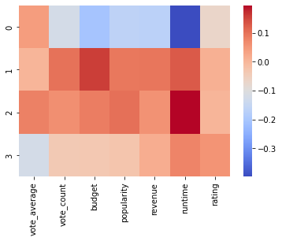
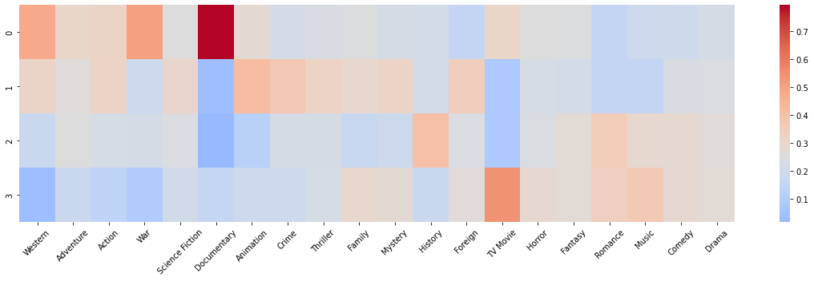
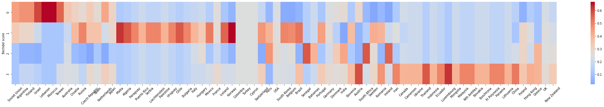
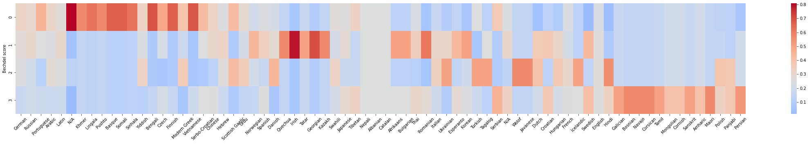

# Features
## Continuous features
- Budget
- Popularity
- Revenue
- Runtime
- Vote average
- Vote count
- Rating
## Categorical features
Encoded as multi-hot vectors (e.g. one feature for 'has spoken English', 'is comedy genre', 'made in USA' etc.)
- Language(s) spoken
- Genre(s)
- Country(ies) produced in
Since each category is encoded as a binary column, we also binned the continuous features into $n=2$ bins so that they could be used as binary features as well.

## Unused features
Several text columns were present that could be used for classification. We tried training a MultiNomial Naive Bayes but underperformed other feature sets. Since Bag of Words is harder to interpret due to high-dimensionality, we stick with non-textual features.

## Data balancing
Bechdel score=3 was most common category (n=1073):

Bechdel score   Count
3               1073
1               553
2               274
0               267

Upsampled all other scores to 1073 rows

# Model selection
- Using Naive Bayes for all models
- Gaussian Naive Bayes for continuous features, Bernoulli Naive Bayes for binary features
- Evaluated using $k=5$ cross-fold validation
Tried following feature permutations:
- Continuous features (Gaussian Naive Bayes)
- All one-hot features (this and all others Bernoulli Naive Bayes)
- One-hot encoding for production countries only
- One-hot encoding for movie genres only
- One-hot encoding for languages spoken only

# Results

- All models outperform baseline
- Model trained on multi-hot features performs best
- Adding binned continuous features to multi-hot features does not result in any improvement
- Of the three groups of multi-hot features (country, language, genre), genre is the most informative feature
- Continuous features are the least informative of all feature subsets considered
- Interestingly, binary bins of continuous features (with a Bernoulli Naive Bayes model) are more informative than continuous values with a Gaussian model

## Feature importance
All heatmaps are sorted by correlation of column with Bechdel score, such that columns on the left of the plot have more concentration of values in lower Bechdel scores (=more sexist) and columns on the right of the plot have more concentration of values in higher Bechdel scores (=less sexist)
### Continuous features

### Binary features

- Documentary has high concentration of Bechdel score=0
  - This is probably not due to sexism per se but rather because Bechdel test is dependent on *dialogue* between two women and documentaries tend to be monologic
- Stereotypically male-targeted genres like western, war, adventure, action are associated with lower Bechdel scores
- Stereotypically female-targeted genres like romance, comedy, drama are associated with higher Bechdel scores

